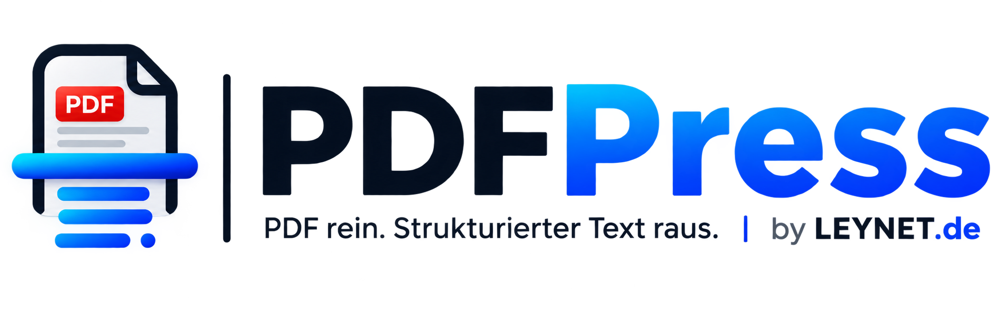
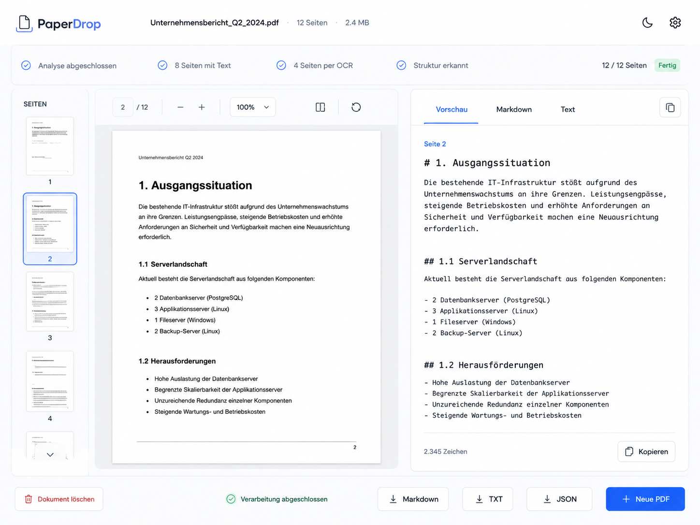

<p align="center"></p>

# PDFPress

**PDF rein. Strukturierter Text raus.**

PDFPress ist eine bewusst schlanke, lokal/self-hosted betreibbare Webanwendung: genau ein PDF hinein, seitenweise vorhandenen Text extrahieren oder bei Bedarf OCR ausführen, Struktur rekonstruieren und Original-PDF sowie strukturierten Text synchron prüfen. Es gibt keine Benutzerkonten, Projekte, Dokumentbibliothek oder Cloud-API.



## Features

- Hybrid-PDF-Verarbeitung pro Seite: eingebetteter Text oder Tesseract-OCR
- Deutsch, Englisch und kombinierte OCR-Sprachen
- Seitenweise Ergebnisse mit Source, Bounding Boxes und OCR-Confidence
- PDF.js-basierter Viewer mit Thumbnails, Zoom und Rotation
- Synchronisierte Seitenwahl zwischen PDF und Text
- Vorschau, Markdown-Quelltext und Plaintext
- Markdown-, TXT- und JSON-Export mit Seitenzuordnung
- Reale Verarbeitungsstatus aus dem Backend
- Temporäre Speicherung mit automatischem Cleanup
- Optionaler Ollama-Strukturierungsschritt mit Fail-safe-Fallback
- Light/Dark Mode
- Keine Datenbank, kein Redis, kein ClamAV

## Quick Start

```bash
cp .env.example .env
docker compose up -d --build
```

Danach: `http://localhost:8080`

Healthcheck: `http://localhost:8080/api/health`

## Anforderungen

- Docker Engine 25+ empfohlen
- Docker Compose v2
- Für Scan-PDFs ausreichend CPU/RAM; OCR ist deutlich rechenintensiver als digitale Textextraktion.

## Konfiguration

Wichtige Werte stehen in `.env`:

```dotenv
APP_PORT=8080
MAX_FILE_SIZE_MB=100
MAX_PAGES=200
DOCUMENT_RETENTION_MINUTES=60
OCR_LANGUAGE=deu+eng
OCR_DPI=200
LLM_ENABLED=false
```

OCR-Sprachen im Standardimage: `deu`, `eng`, `deu+eng`.

## Optional: Ollama

Externes Ollama:

```dotenv
LLM_ENABLED=true
OLLAMA_BASE_URL=http://host.docker.internal:11434
OLLAMA_MODEL=qwen3:1.7b
```

Oder Ollama als zusätzlicher Compose-Service:

```bash
docker compose -f docker-compose.yml -f docker-compose.ollama.yml up -d --build
```

Das Modell muss anschließend in Ollama vorhanden sein. Wenn Ollama nicht erreichbar ist, nutzt PDFPress automatisch die regelbasierte Strukturierung weiter.

## Tests

```bash
python -m venv .venv
. .venv/bin/activate
pip install -r backend/requirements-dev.txt
python scripts/generate_fixtures.py
pytest
```

Frontend-Build:

```bash
cd frontend
npm install
npm run build
```

## Datenschutz

Dokumente werden ausschließlich temporär unter einer zufälligen internen UUID verarbeitet. Der Originaldateiname wird nicht als Dateisystempfad benutzt. Ein periodischer Cleanup löscht abgelaufene Jobs einschließlich Original-PDF und OCR-Artefakten. Standard: 60 Minuten.

## Troubleshooting

**OCR ist langsam:** `OCR_DPI` reduzieren, z. B. von 200 auf 160. Digitale PDF-Seiten werden nicht durch OCR geschickt.

**Deutsch nicht erkannt:** `OCR_LANGUAGE=deu` oder `deu+eng` setzen. Das Docker-Image enthält beide Tesseract-Sprachpakete.

**PDF wird abgelehnt:** PDFPress prüft Dateiendung, Upload-Limit und `%PDF-` Magic Bytes. Beschädigte oder verschlüsselte PDFs werden beim Analysieren abgewiesen.

Weitere Details: `docs/architecture.md`, `docs/deployment.md`, `docs/configuration.md`, `docs/security.md`, `docs/ocr-pipeline.md`.

## Lizenz

PDFPress ist freie Software unter der [GNU Affero General Public License v3.0](LICENSE).

PDFPress nutzt [PyMuPDF](https://github.com/pymupdf/PyMuPDF) (AGPL-3.0 bzw. kommerzielle Lizenz von Artifex) für PDF-Rendering und Textextraktion. Da PDFPress als Netzwerkdienst betrieben wird, verlangt die AGPL, Nutzern Zugriff auf den vollständigen Quellcode der laufenden Version zu geben — deshalb steht dieses Repository selbst unter der AGPL-3.0, und die laufende Instanz verlinkt in der Fußzeile und im Info-Dialog hierher.
